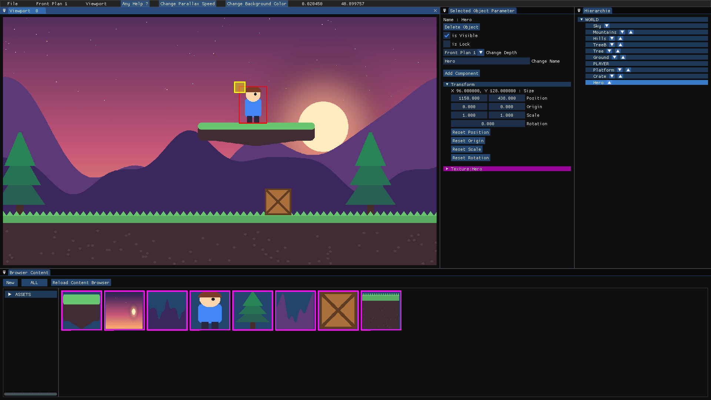
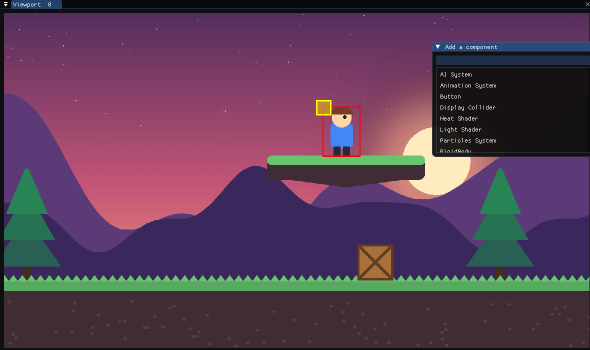
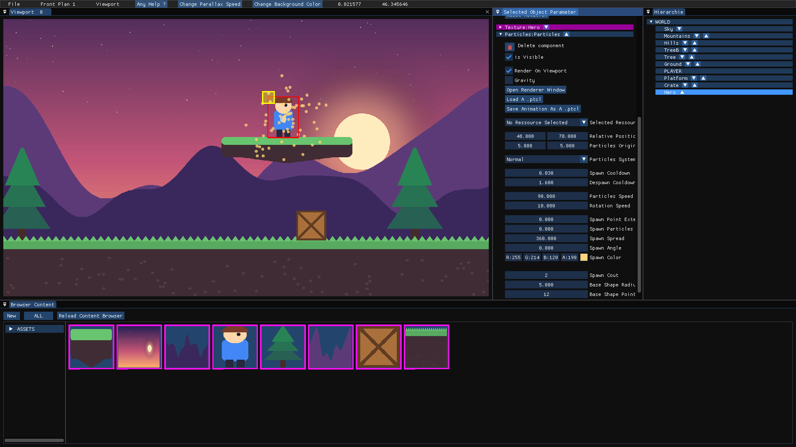
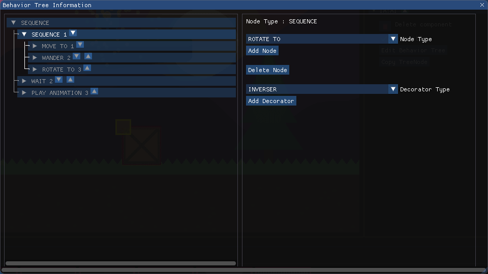

> [!IMPORTANT]
> # Disclaimer: Educational Project Context
>
> LogiCraft was developed during our first year of C++ studies. The project was built by three main contributors over a span of just three months.
>
> At the time, we were unfamiliar with game engine architecture and learned the GameObject/GameComponent system "on the fly" while developing. As a result of these strict time constraints and our simultaneous learning process, the codebase is not optimized and would require a complete refactor to meet professional/usable standards. We have chosen to keep the repository in its original state to provide context on our development journey and ability to deliver under pressure.
>
> With this in mind, enjoy the **Logicraft** !

---

# Logicraft 🎮

**Logicraft** is a 2D game engine and level editor written in **C++20** with **SFML** and **Dear ImGui**. It lets you build video game scenes through a **no-code interface**: drop textures into the viewport, stack them on parallax layers, attach components (animations, particles, shaders, AI, physics…) and export the result for the game runtime.



<sub>A sample scene built in the editor: sky, mountains and hills on background layers, gameplay objects on the front layers, the selected object in the inspector and its place in the hierarchy.</sub>

---

## 📑 Table of Contents

- [About the Project](#-about-the-project)
- [Screenshots](#-screenshots)
- [Key Features](#-key-features)
- [Editor Tour](#-editor-tour)
- [Keyboard & Mouse Shortcuts](#%EF%B8%8F-keyboard--mouse-shortcuts)
- [Getting Started](#-getting-started)
- [Project Structure](#-project-structure)
- [File Formats](#%EF%B8%8F-file-formats)
- [Technical Stack](#%EF%B8%8F-technical-stack)
- [Contributors](#-contributors)
- [License](#-license)

---

## 📖 About The Project

Logicraft was designed to emulate a simplified version of professional engines like Unity. The core goal was to build a tool that separates the **engine code** from the **game design**, allowing a user to assemble a scene visually.

The editor creates a hierarchy of objects where users can attach components to entities to give them behavior, appearance, and logic. Scenes are saved in an editable project file and exported as baked layers that a game can load at runtime.

---

## 📸 Screenshots

| Component library | Particle system |
| :---: | :---: |
|  |  |
| Every object can receive components from a searchable list. | Particles are tuned live from the inspector (spawn rate, spread, color, shape…). |

| Behavior Tree editor |
| :---: |
|  |
| AI is described as a behavior tree (sequences, selectors, actions and decorators) attached to an object. |

---

## ✨ Key Features

### Rendering & Visuals
* **Static Assets:** Drag-and-drop PNG textures from the content browser straight into the viewport.
* **Animations:** 2D sprite sheet animations.
* **Custom Shaders:**
    * **Water Shader:** Distortion and reflection effects.
    * **Heat Shader:** Heat haze / distortion effects.
    * **Light Shader:** Dynamic light for the player plan.
* **Parallax Scrolling:** 14 depth layers (`Front Plan 1-4`, `Player Plan`, `BackGround 1-9`) with a per-layer speed factor editable from the toolbar.
* **Particle System:** Built-in emitter, previewable in a dedicated renderer window and savable as a `.ptcl` preset.

### Gameplay & Logic
* **Behavior Tree AI:** Sequences, selectors, actions (`MOVE TO`, `WANDER`, `PLAY ANIMATION`, `PLAY SOUND`, `ROTATE TO`, `WAIT`…) and decorators (`INVERSER`, `CONDITION` such as `IS_PLAYER_IN_SIGHT` / `IN_RANGE_OF_PLAYER`, `LOOP`).
* **Stat System:** Life, speed, range and dexterity stats for AI-driven objects.
* **RigidBody & Colliders:** Physics body and debug collider display.
* **Events:** Event resources edited in a node graph (imnodes).
* **Player Management:** Player spawn position and player screen zone.

### Architecture & Editor
* **GameObject / Component System:** Inspired by Unity, entities are composed of components.
* **Scene Hierarchy:** Parent-child tree, reordering, copy/paste, multi-selection.
* **Multiple Viewports:** Several cameras on the same scene, with zoom, pan and lock options.
* **Screen Zones:** The world is split into 1920×1080 zones that you enable/disable to define the playable area.
* **ImGui Interface:** The whole editor (inspector, hierarchy, content browser, toolbars) is built with **Dear ImGui** (docking branch).

---

## 🧭 Editor Tour

| Panel | Role |
| --- | --- |
| **Toolbar** | `File` menu (New / Load / Save / Export / Exit), active layer selector, viewport menu, help, parallax speed and background color. |
| **Viewport** | Renders the scene. Drop resources here, select and move objects, zoom with the mouse wheel. |
| **Selected Object Parameter** | Inspector of the selected object: visibility, lock, depth layer, name, and every component (`Transform`, `Texture`, `Particles`, `IA`…). |
| **Hierarchie** | Scene tree. Click to select, right click to create objects, arrows to reorder. |
| **Browser Content** | Project resources (`ASSETS` folder): textures, fonts, events… with filters by type. |

Typical workflow:

1. Put your PNG files in the `ASSETS` folder (or create resources with **New** in the content browser).
2. Pick the target layer in the toolbar (e.g. `BackGround 7` for a sky).
3. Drag a resource from the content browser into the viewport and give the new object a name.
4. Fine-tune it in the inspector and attach components with **Add Component**.
5. `File > Save As` to keep an editable `.lcp` project, `File > Export as` to bake the scene for the game.

---

## ⌨️ Keyboard & Mouse Shortcuts

These are the shortcuts listed in the editor's **Any Help ?** window.

| Input | Action |
| --- | --- |
| `Z` `Q` `S` `D` / arrow keys / `Right click + drag` | Move the viewport camera |
| `Mouse wheel` | Zoom in / out in the focused viewport |
| `F11` | Toggle fullscreen |
| `Delete` | Delete all selected objects |
| `Ctrl + N` | Clear and create a new scene |
| `Ctrl + O` | Open the load menu |
| `Ctrl + S` | Open the save menu |
| `Ctrl + E` | Open the export menu |
| `Ctrl + W` | Close the program |
| `Ctrl + release Left Click` (while dragging a resource) | Add the resource as a component to the hovered object |
| `Ctrl + Left Click` on an unused screen zone | Enable the screen zone |
| `Ctrl + Right Click` on a used screen zone | Free the screen zone |
| `Ctrl + Left Click` on objects | Multiple selection |
| `Ctrl + C` / `Ctrl + V` | Copy / paste the selected objects |
| `Shift + Left Click` | Select an object and all its children in the hierarchy |

---

## 🚀 Getting Started

> [!NOTE]
> The project targets **Windows** and **Visual Studio 2022** (`v143` toolset, C++20). Third-party libraries and the `Ressources` folder are **not** stored in the repository.

### Prerequisites

| Dependency | Usage |
| --- | --- |
| [Visual Studio 2022](https://visualstudio.microsoft.com/) with the *Desktop development with C++* workload | Build |
| [SFML 2.6.0](https://www.sfml-dev.org/download/sfml/2.6.0/) | Window, graphics, audio |
| [sfeMovie](https://github.com/Yalir/sfeMovie) | Video playback (`sfeMovie.lib`) |
| [Native File Dialog](https://github.com/mlabbe/nativefiledialog) | Open/save dialogs (`nfd.lib`) |
| `SFML_ENGINE` | In-house helper library (sources in `LogiCraft/imgui/SFML_ENGINE`) |

Dear ImGui, ImGui-SFML and imnodes are already included in the sources.

### Build

1. Clone the repository:
   ```bash
   git clone https://github.com/Xanhos/LogiCraft.git
   ```
2. Extract SFML 2.6.0 next to the solution so that `SFML-2.6.0/include` and `SFML-2.6.0/lib` exist at the repository root, then add the `sfeMovie`, `nfd` and `SFML_ENGINE` `.lib` files to `SFML-2.6.0/lib`.
3. Create a `Ressources` folder one level above the executable's working directory (the editor reads `../Ressources`):
   ```text
   Ressources/
   ├── parallax.txt            # 14 parallax speed factors, one per layer
   └── ALL/
       ├── Textures/           # Placeholder.png, loading.png, Used_Screen_Zone.png, Unused_Screen_Zone.png, poubelle.png
       ├── Fonts/              # arial.ttf
       ├── SHADERS/            # Heat_map.png, Water_map.png
       └── SOUNDS/  MUSICS/  MOVIES/
   ```
4. Open `LogiCraft.sln`, select **x64** and **Release** (or Debug), build and run the `LogiCraft` project. Copy the SFML DLLs next to the executable if needed.

---

## 📂 Project Structure

```text
LogiCraft/
├── LogiCraft/                  # The editor
│   ├── main.cpp                # Entry point (1920x1080 window)
│   ├── Game.*  State.*         # Main loop and state stack
│   ├── EditorState.*           # Editor state: scene, viewports, menus
│   ├── GameObject.*            # Entity with a component list and children
│   ├── GameComponent.*         # Base class of every component
│   ├── Transform  Texture  Animation  Particule  RigidBody  AI  BehaviorTree
│   ├── HeatShader  WaterShader  LightShader  Convex  Button  Font  Event  StatSystem
│   ├── Hierarchie  BrowserContent  Viewport  ToolsBar  MainMenu   # Editor panels
│   ├── imgui/                  # Dear ImGui, ImGui-SFML, SFML_ENGINE helpers
│   └── imnodes.*               # Node editor used by events
├── Exportation_LogiCraft/      # Post-export tool (removes fully transparent layer images)
└── LogiCraft.sln
```

---

## 🗂️ File Formats

| Extension | Content |
| --- | --- |
| `.lcp` | Editable project (objects, components, used screen zones). Reloaded with `File > Load`. |
| `.lcg` | Exported game data read by the runtime. |
| `*_layer_N.png` | Baked images of each screen zone and layer, generated on export. |
| `.ptcl` | Particle system preset. |
| `.evt` | Event resource. |

---

## ⚙️ Technical Stack

* **Language:** C++20
* **Rendering / Audio:** SFML 2.6
* **UI Library:** Dear ImGui (docking) + ImGui-SFML, imnodes
* **Architecture:** GameObject / GameComponent composite pattern
* **IDE:** Visual Studio 2022

---

## 👥 Contributors

This engine was the result of a collaborative effort by:

* [Yann Grallan / Xanhos](https://github.com/Xanhos)
* [Charles Lesage / sharllesse](https://github.com/sharllesse)
* [Samy MENA-BOUR / SamyMENA-BOUR](https://github.com/SamyMENA-BOUR)

---

## 📝 License

Distributed under the MIT License. See [`LICENSE`](LICENSE) for more information.

*Thanks for checking out Logicraft!*
